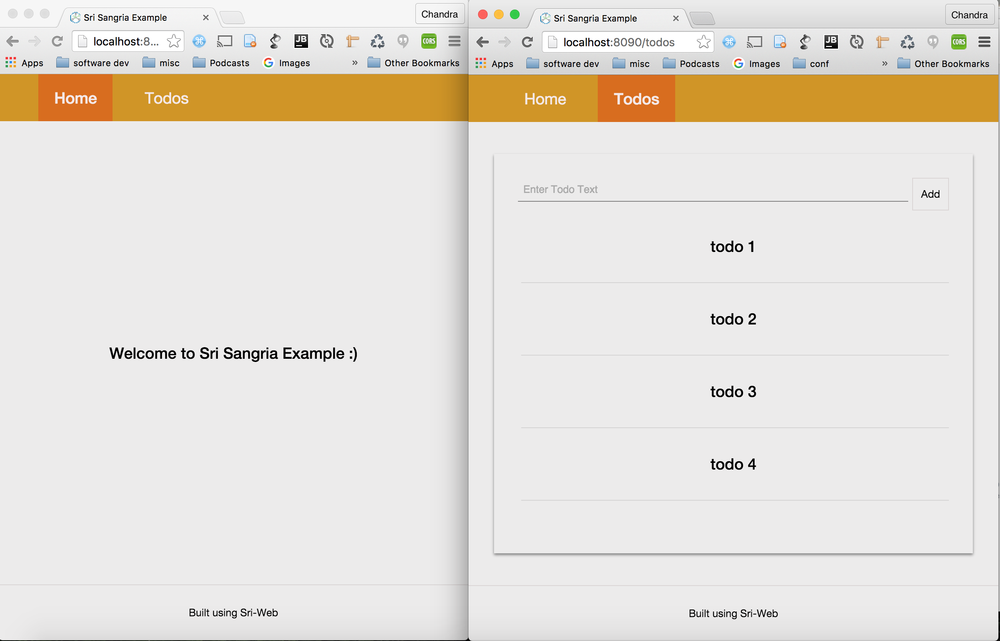
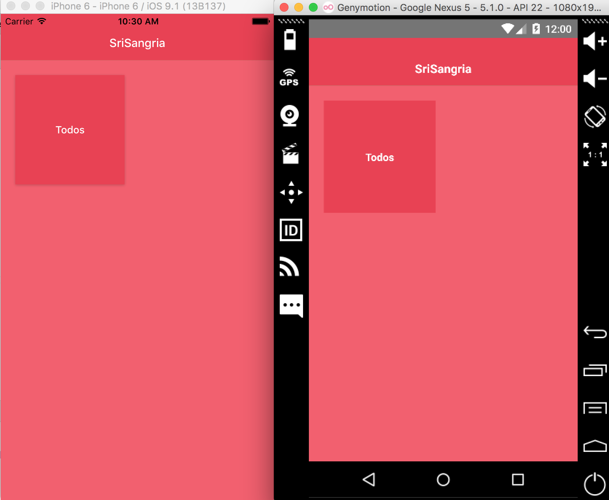
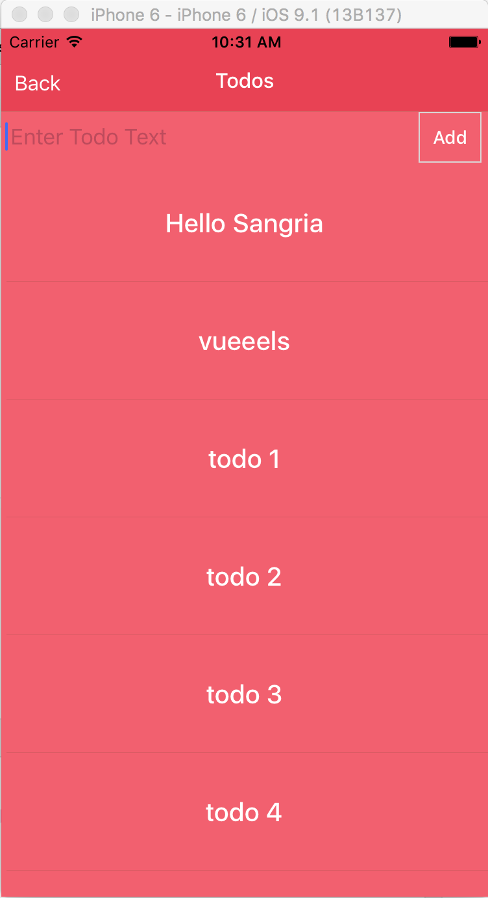

# sri-sangria-example

An example app written using [sangria-graphql](http://sangria-graphql.org/) (backend) and [sri](https://github.com/chandu0101/sri) (frontend).








### How to Run


***Server*** : 

```
sbt "project server" ~re-start

      or

sbt "project server-mongo" ~re-start (if you have mongodb installed on u r machine)
     
```     

***relay schema*** :

```
//in root(sri-sangria-example) directory

npm install

npm run schema-fetch // it will fetch schema.json file from server

```
      
***Web Client*** :
      
```
sbt ~fastOptJS

// open a new terminal tab

cd web

npm install

npm start

// open http://localhost:8090/ in your fav browser :) 

```
      
***Mobile Client*** :
      

https://github.com/chandu0101/sri-mobile-template#how-to-run